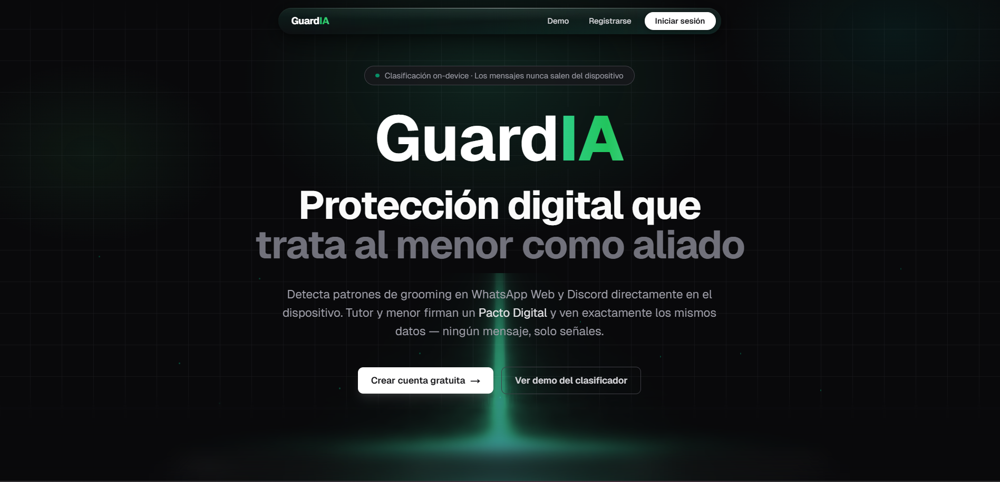

# GuardIA — Pacto Digital

Capa de protección digital para menores: detección on-device de patrones de grooming + dashboard familiar transparente basado en un Pacto Digital firmado entre tutor y menor.

**Principio rector:** el menor es aliado, no sospechoso. Romper el paradigma de la vigilancia total.

> Demo en producción (Vercel): https://guard-black.vercel.app/
>
> Video demo: https://www.youtube.com/watch?v=zSVREocmBN8



---

## Problema que resuelve

El grooming digital es un patrón lingüístico progresivo (love bombing → escalamiento de intimidad → aislamiento emocional → ofertas engañosas → mover la conversación a un canal privado). Las soluciones actuales obligan a elegir entre dos extremos malos:

1. **Vigilancia parental total** — el tutor lee todos los mensajes del menor. Rompe la confianza, dispara conductas de evasión (cuentas alternas, apps ocultas) y es ciega al escenario en que el abusador está dentro del hogar.
2. **No hacer nada** — confiar en que el menor pedirá ayuda, cuando la literatura muestra que el silencio y la vergüenza son la norma.

Guard propone una tercera vía:

- La detección corre **100% en el dispositivo del menor**. El contenido de los mensajes nunca sale del navegador.
- El tutor solo recibe **señales categorizadas** (timestamp + plataforma + etiqueta + nivel de riesgo), nunca el texto.
- Tutor y menor ven **exactamente la misma información** en el dashboard — transparencia total, sin asimetría.
- Existe un **botón SOS** que contacta a un adulto de confianza **distinto del tutor** (tía, abuela, maestra), porque a veces el riesgo está en casa.
- Todo se rige por un **Pacto Digital** firmado entre tutor y menor donde se acuerda explícitamente qué categorías se monitorean.

---

## Tecnologías y herramientas

### Dashboard (web)

- [Next.js 16.2.4](app/) (App Router) + React 19.2 + TypeScript 5
- Tailwind CSS 4 + Radix UI + shadcn
- Recharts 3.8.1 para el gráfico de señales por día
- [Supabase](lib/supabase/) (Auth, PostgreSQL con Row Level Security, Realtime) — ver migraciones en [supabase/migrations/](supabase/migrations/)
- Server Actions de Next.js para login, registro, creación y firma de pactos, SOS y acknowledgment

### Extensión Chrome (on-device)

- Manifest V3, content scripts para WhatsApp Web y Discord
- ONNX Runtime Web (WASM SIMD + threading) en un offscreen document
- esbuild para el bundle de [extension/src/](extension/src/)

### Modelo de Machine Learning

- XLM-RoBERTa-base / MiniLM multilingüe, fine-tuned para clasificación multi-label (5 etiquetas, sigmoid)
- Cuantización dinámica int8 → ~113 MB
- Inferencia con ONNX Runtime Web (extensión) y `@huggingface/transformers` 4.2.0 (demo en [/demo](app/demo/))
- Documentación completa del pipeline de entrenamiento en [MODELO.md](MODELO.md)

### Datos

- [PAN-2012 Sexual Predator Identification Corpus](https://pan.webis.de/) traducido EN→ES con MarianMT (`Helsinki-NLP/opus-mt-en-es`)
- 797 ejemplos sintéticos curados manualmente en español mexicano (Robux, V-bucks, gift cards, OXXO, WhatsApp, Snap, etc.)
- Weak-labeling con regex en español sobre el corpus traducido

---

## Estructura del repo

```
app/                  # Next.js App Router (dashboard + auth + API + demo)
extension/            # Extensión Chrome Manifest V3 (ONNX on-device)
lib/                  # Clientes Supabase, agregaciones, tipos generados
supabase/migrations/  # SQL aplicado en orden (001–005)
models/guardia/       # Artefacto canónico del modelo entrenado (no en git)
public/models/guardia/# Copia servida por la demo en navegador
```

---

## Instrucciones para ejecutar el prototipo

> **Atajo:** si solo quieres ver el dashboard funcionando, puedes abrir directamente la versión en producción hosteada en Vercel: **https://guard-black.vercel.app/** (registro tutor/menor/adulto de confianza, creación y firma del Pacto, vista compartida y SOS están operativos). Para ver la detección on-device de la extensión Chrome sigue siendo necesario el build local descrito abajo.

### Requisitos previos

- Node.js ≥ 20 y `pnpm` (recomendado) o `npm`
- Un proyecto de Supabase (gratis) con las migraciones de [supabase/migrations/](supabase/migrations/) aplicadas
- Chrome / Chromium reciente para cargar la extensión
- Los archivos del modelo (`model_quantized.onnx`, `tokenizer.json`, `tokenizer_config.json`, `config.json`, `ort_config.json`) en `public/models/guardia/` — no están en git por tamaño (~113 MB), se distribuyen como artefacto aparte

### 1. Instalar dependencias

```bash
pnpm install
```

### 2. Variables de entorno

Crear `.env.local` en la raíz con:

```env
NEXT_PUBLIC_SUPABASE_URL=https://<tu-proyecto>.supabase.co
NEXT_PUBLIC_SUPABASE_ANON_KEY=<anon-key>
```

Y reflejar los mismos valores en [extension/src/config.ts](extension/src/config.ts) (`SUPABASE_URL`, `ANON_KEY`, `DASHBOARD_URL`).

### 3. Levantar el dashboard

```bash
pnpm dev
```

Abrir [http://localhost:3000](http://localhost:3000). Flujo sugerido:

1. Registrarse como **tutor** → se crea automáticamente la familia (UUID compartible).
2. Registrar al **menor** y al **adulto de confianza** con ese UUID.
3. Tutor crea un **Pacto Digital** eligiendo categorías a monitorear (estado: `pending`).
4. Menor firma el pacto (estado → `signed`). A partir de aquí RLS permite insertar señales.

La demo del clasificador on-device (sin extensión) está en [http://localhost:3000/demo](http://localhost:3000/demo).

### 4. Compilar y cargar la extensión Chrome

```bash
pnpm build:extension
```

Esto copia los binarios WASM de ONNX Runtime a `extension/wasm/` y bundlea el background, offscreen, popup y content scripts. Después:

1. Abrir `chrome://extensions`, activar **Modo desarrollador**.
2. **Cargar descomprimida** → seleccionar la carpeta `extension/`.
3. Iniciar sesión con la cuenta del **menor** desde el popup de la extensión.
4. Navegar a WhatsApp Web o Discord. Los mensajes se clasifican on-device; las señales aparecen en vivo en el dashboard del tutor y del menor.

### 5. (Opcional) Re-entrenar el modelo

Pipeline completo y reproducible documentado en [MODELO.md §14](MODELO.md). Resumen:

```bash
cd ml
python3.11 -m venv .venv && source .venv/bin/activate
pip install -r requirements.txt
# Colocar los 3 archivos de PAN-2012 en data/pan_raw/
python -m src.parse_pan
python -m src.translate
python -m src.weak_label
python -m src.merge_synthetic
python -m src.train
python -m src.export_onnx
python -m src.test_inference
```

Tiempo total esperado en RTX 3060: ~20 min.

---

## Herramientas de IA utilizadas

Documentamos explícitamente cada herramienta de IA empleada, en qué parte del proyecto y con qué alcance.

### 1. XLM-RoBERTa-base / MiniLM multilingüe (clasificador propio)

- **Qué es:** modelo base `sentence-transformers/paraphrase-multilingual-MiniLM-L12-v2` (Apache 2.0, ~118M parámetros) fine-tuneado por nosotros para clasificación multi-label en español.
- **Para qué:** detectar las 5 categorías de grooming (`love_bombing`, `intimacy_escalation`, `emotional_isolation`, `deceptive_offer`, `off_platform_request`) sobre cada mensaje capturado por la extensión.
- **En qué medida:** núcleo del componente de detección. Corre 100% on-device vía ONNX Runtime Web. Macro-F1 = 0.881 en test set. Entrenamiento previo al hackatón documentado en [MODELO.md](MODELO.md) (declarado conforme al reglamento).

### 2. MarianMT — `Helsinki-NLP/opus-mt-en-es`

- **Qué es:** modelo de traducción automática EN→ES (CC-BY 4.0, ~300 MB).
- **Para qué:** traducir al español los ~50K mensajes del corpus PAN-2012 (originalmente en inglés) durante la fase de preparación de datos.
- **En qué medida:** uso offline, una sola vez, durante el pipeline de entrenamiento. No forma parte del producto en runtime.

### 3. ONNX Runtime Web (Microsoft)

- **Qué es:** motor de inferencia WASM para correr modelos ONNX en el navegador.
- **Para qué:** ejecutar el clasificador cuantizado int8 dentro de la extensión Chrome, en un offscreen document aislado del DOM.
- **En qué medida:** dependencia crítica de la extensión. Es la pieza que permite que ningún mensaje salga del dispositivo del menor.

### 4. `@huggingface/transformers` (Transformers.js) 4.2.0

- **Qué es:** librería JS de Hugging Face para cargar modelos y tokenizadores en el navegador.
- **Para qué:** demo del clasificador en [/demo](app/demo/) (ruta pública del dashboard) y tokenización rápida del modelo XLM-R en la extensión.
- **En qué medida:** infra de inferencia en el cliente; no envía nada a servidores externos.

### 5. Hugging Face `transformers`, `datasets`, `optimum`, `evaluate` (offline)

- **Qué es:** ecosistema Python de Hugging Face.
- **Para qué:** fine-tuning del modelo, manejo del corpus, exportación a ONNX y cuantización dinámica int8.
- **En qué medida:** uso offline en el pipeline de entrenamiento. Detalles en [MODELO.md §6–§8](MODELO.md).

### 6. PyTorch 2.6 + CUDA 12.4

- **Qué es:** framework de deep learning.
- **Para qué:** backend de entrenamiento del clasificador en GPU local (RTX 3060) y de la traducción con MarianMT.
- **En qué medida:** únicamente offline durante el entrenamiento.

### 7. Asistentes de IA en el flujo de desarrollo (Claude Code, ChatGPT)

- **Para qué:** apoyo en la redacción de código, debugging, generación de SQL para migraciones, revisión de UI/UX y refactors. Curaduría humana de cada cambio antes de commit.
- **En qué medida:** acelerador de productividad durante el hackatón. Ningún componente del producto en runtime invoca un LLM externo — toda la inferencia que ven los usuarios finales es nuestro propio modelo on-device.

### Lo que **no** hacemos con IA

- No mandamos contenido de mensajes a ningún LLM externo (OpenAI, Anthropic, Google, etc.).
- No usamos APIs de moderación de terceros que requieran subir el texto.
- No entrenamos sobre datos del menor: el modelo es estático, se distribuye firmado y se puede auditar por hash.

---

## Estado del proyecto

- ✅ Auth + registro por rol + protección de rutas
- ✅ Dashboard tutor (área chart, tabla en vivo Realtime, breakdown por etiqueta y plataforma)
- ✅ Dashboard menor (idéntico al tutor + SOS + firma de pacto)
- ✅ Adulto de confianza (alertas SOS + acknowledgment, sin acceso del tutor por RLS)
- ✅ Pacto Digital (creación, firma, visualización compartida)
- ✅ API `/api/signals` validada (Bearer JWT + pacto firmado + categoría monitoreada)
- ✅ Extensión Chrome (Manifest V3, WhatsApp Web, Discord, ONNX offscreen)
- ✅ Demo ONNX en navegador (`/demo`)
- ✅ 5 migraciones SQL aplicadas con RLS configurado

---

## Equipo

- **Leonardo Hernández Carmona**
- **Carlos Ricardo Arias Juárez**
- **Donnovan Josue Ramírez Coronado**

---

## Licencia y créditos

Trabajo desarrollado para Hackathon404 2026. Detalles del modelo, datasets, licencias y referencias académicas en [MODELO.md §15](MODELO.md).
